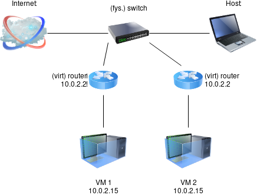
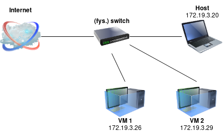
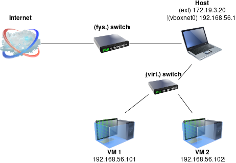

% VirtualBox Networking Overview
% Enterprise Linux
% HOGENT applied computer science

# Introduction

## Before we begin

Set up the test environment

```console
$ cd elnx-syllabus/demo
$ vagrant up db
[...]
$ vagrant ssh db
```

## Agenda

- Network interface types
    - NAT
    - Host-only
    - Bridged
    - Internal
- Recommendations

# NAT adapter

## NAT adapter

NAT = Network Address Translation



## Pro/con

- Reliable *Internet access*
- **Not routable** from host system

## IP settings

Expected values:

| Host    | IP           |
| :---    | :---         |
| VM      | 10.0.2.15/24 |
| Gateway | 10.0.2.2     |
| DNS     | 10.0.2.3     |

# Bridged adapter

## Bridged adapter



## Pro/con

- *Routable* from host system
    - and even other hosts on the LAN!
- *Internet access*
- **Inconsistent** IP settings
    - Different subnet / IP
    - May not receive IP settings from DHCP

# Host-only adapter

## Host-only adapter



## Pro/con

- *Routable* from host system
- *Consistent* IP settings
- **No Internet** access

## IP settings

The "default" host-only network:

|              | IP              |
| :---         | :---            |
| Host system  | 192.168.56.1/24 |
| Virtual DHCP | 192.168.56.100  |
| Range from   | 192.168.56.101  |
| Range to     | 192.168.56.254  |

Range 2-99 can be assigned as static IP addresses

# Internal network adapter

## Internal adapter

- Like Host-Only, but
    - **not** routable from host system
    - no DHCP

# Recommendation

## Recommendation

Give your VMs two adapters:

- Adapter 1: *NAT*
    - for reliable internet access
- Adapter 2: *Host-only*
    - to access VM as server over the network
    - on a predictable IP address

Best of both worlds!
